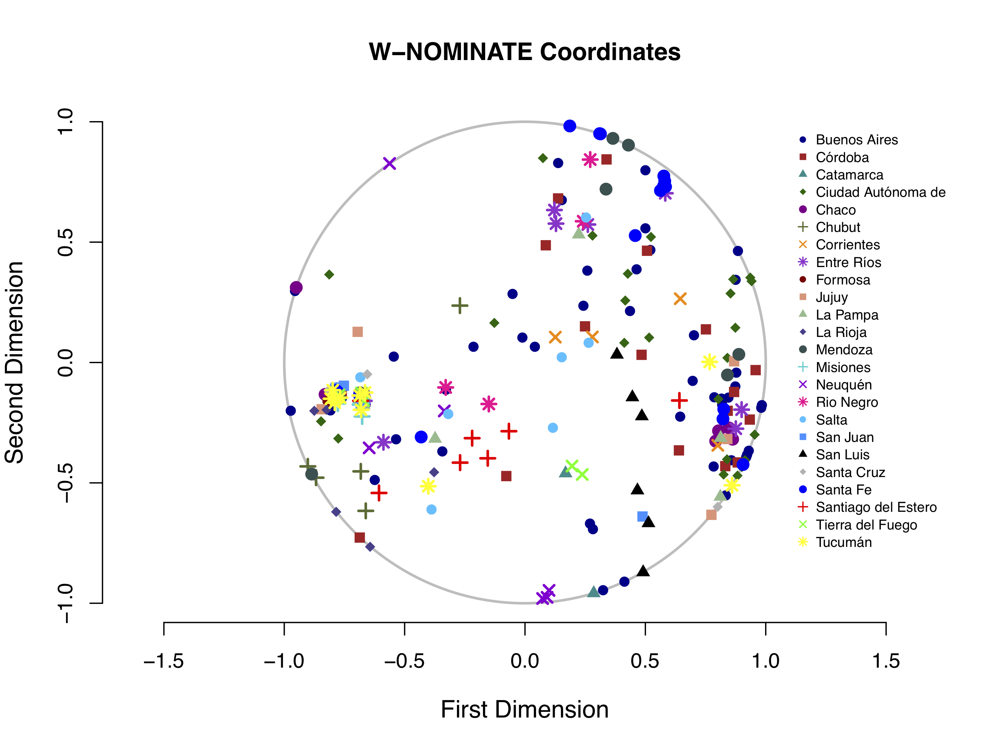
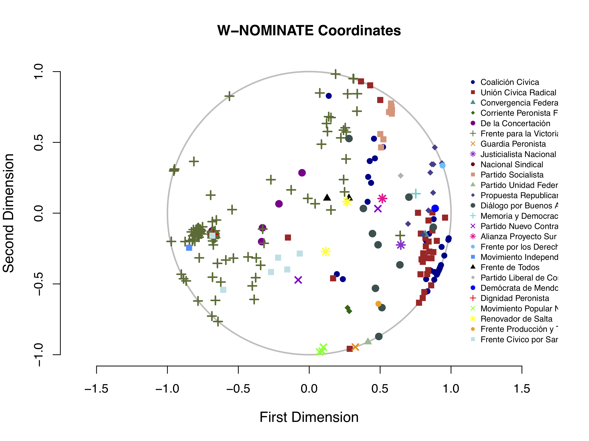
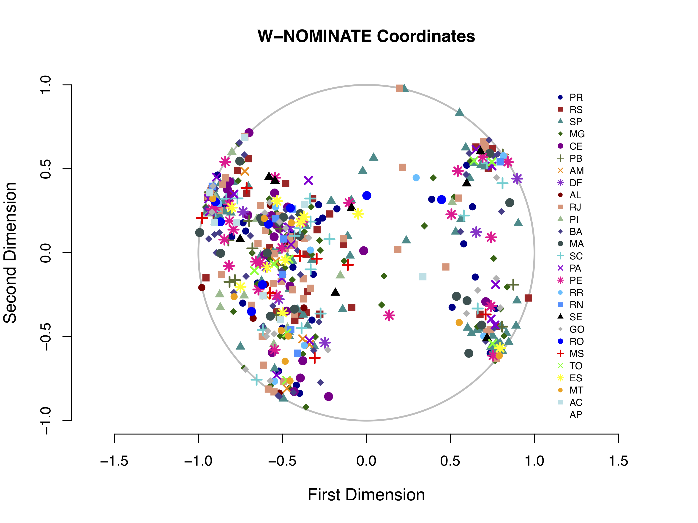
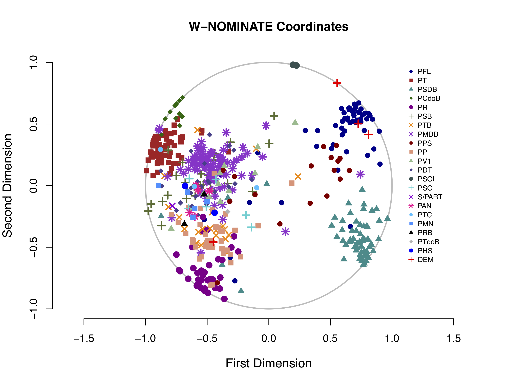
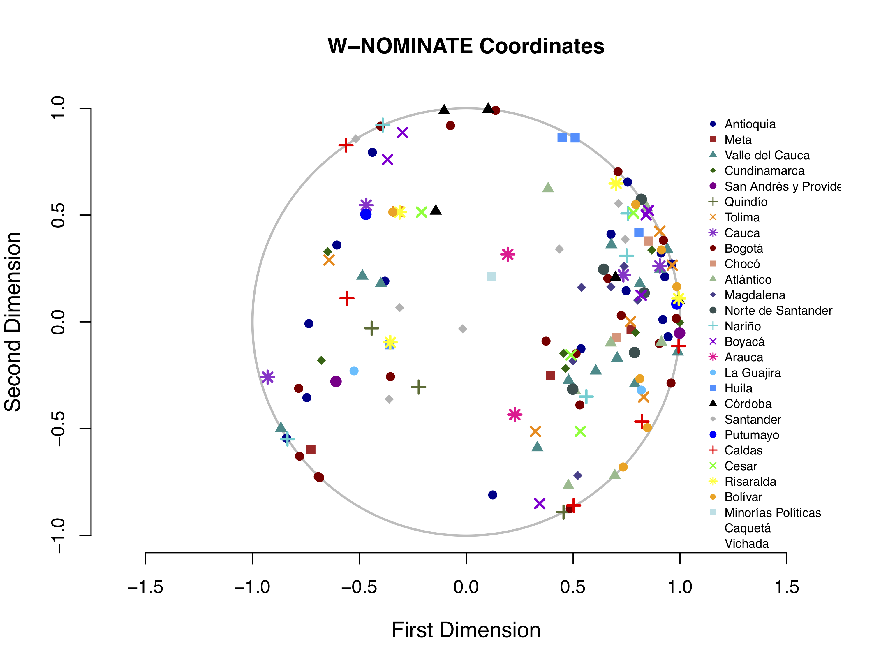
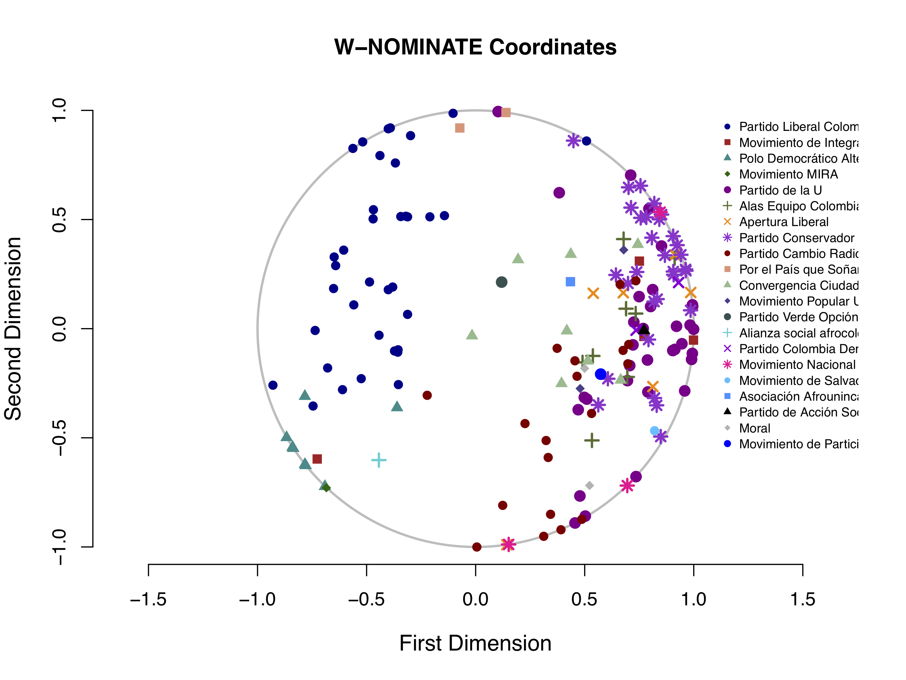

```{r setup, include=FALSE}
knitr::opts_chunk$set(echo = TRUE)
```
\newpage

# Introduction

This appendix presents supplementary materials for the paper _Legislative Outcomes and Malapportionment: Evidence from Latin America_, which I am using as the main writing sample for my application to Political Science PhD programs. Here you will find illustrative content that helps get a clearer diagnosis of the scale of malapportionment in the cases I studies, as well as parts of the analysis that contributed to my main results, but were not included in the article, such as the ANOVAs for ideal point estimates.

The remainder of the replication materials are available for consultation in [this GitHub repository](https://github.com/catarinaroman/malapportionment-lat-am/data). The largest datasets, containing Brazilian and Colombian roll call votes, will be hosted at (other link), as they are too heavy for GitHub. If you have any questions, please do not hesitate to contact me at [catarinamroman@gmail.com](mailto::catarinamroman@gmail.com).

# Abstract

This paper investigates the effects of malapportionment on lawmaking using the national congresses of Argentina, Brazil, and Colombia as case studies. I build counterfactual well-apportioned congresses through a naïve correction method. I simulate the outcomes of more proportional roll call votes and compare them against the results from 2007 to 2010. I find that malapportionment alters legislative outcomes, and that partisanship acts as a mediator. Depending on party system features, the effect can either favor or weaken the winning coalition. Argentina and Colombia have the largest malapportionment indexes, while Brazil is less disproportionate. In Argentina's counterfactual assembly, the government party would be stronger, reducing the effective power of the opposition. Colombia presents surprisingly high malapportionment effects despite small changes in partisan seat distribution. Qualitative assessment indicates this is due to shifts in the composition of the winning coalition and to undisciplined incumbents. This paper has implications for the design and reform of legislative institutions and for the study of constitutional democratic distortions.

# Diagnosing Malapportionment

To aid foreign readers get a visual depiction of the geographical patterns of malapportionment, I present self-produced heat maps representing the population/seat ratio. This means the provinces/states in a deeper tone of red are overrepresented, and those that have a lighter shade of yellow are underrepresented.

{width=30%}

{width=50%}

{width=50%}

The maps are but an illustration of the analysis I propose in the main paper. The disparities are large in all three countries, with a slight difference in cause. In Argentina and Brazil, the problem seems to be one of underrepresentation of very populous urban centers, while in Colombia, the issue is of overrepresentation of a large number of sparsely populated _departamientos_.

# Reapportionment: Naïve Correction

The correction I propose is naïve. It is based on the idea that each province is entitled to one single legislator, and the rest of the chamber is filled in by proportional amounts of representatives from the more populated provinces.

I will illustrate the procedure with the Argentinian case, but the same logic applies to Brazil and Colombia. Considering that the Argentinian Congress was composed of 256 legislators, and I wished to maintain the size of the chamber very close to the original, a proportional apportionment would assign one representative to every 0.39% of the national population (1/256 equals a share of one legislator for 0.0039*population). According to Table \ref{t1_arg}, Tierra del Fuego, the smallest province in Argentina, has a population of 127,205, which represents a share of 0.00317 of the population. Even though Tierra del Fuego does not reach the .39% requirement, no province can go unrepresented, and it is thus entitled to a single representative, in contrast to the 5 it has in reality under malapportionment. Looking at the other extreme, Buenos Aires and its population of 15,625,084, or 39% of the Argentinian population, is assigned the amount of 100 representatives.

\begin{table}[!htb]
\caption{Malapportionment in Argentina 2007 national elections}
\centering
\label{t1_arg}
\scalebox{0.8}{
\begin{tabular}{rlrrrr}
  \hline \hline
 & Provinces & Population & Share of Population & Pop / Seats Malap. & Pop / Seats Reap.  \\ 
  \hline
  1 & Catamarca & 367828 & 0.00917 & 73565.60 & 183914 \\ 
  2 & Chubut & 509108 & 0.01269 & 101821.60 & 169702.67 \\ 
  3 & Formosa & 530162 & 0.01321 & 106032.40 & 176720.67 \\ 
  4 & La Pampa & 318951 & 0.00795 & 63790.20 & 159475.50 \\ 
  5 & La Rioja & 333642 & 0.00832 & 66728.40 & 166821 \\ 
  6 & NeuquEn & 551266 & 0.01374 & 110253.20 & 137816.50 \\ 
  7 & Rio Negro & 638645 & 0.01592 & 127729 & 159661.25 \\ 
  8 & San Luis & 432310 & 0.01055 & 86462 & 144103.33 \\ 
  9 & Santa Cruz & 273964 & 0.00683 & 54792.80 & 136982 \\ 
  10 & Tierra del Fuego & 127205 & 0.00317 & 25441 & 127205 \\ 
  11 & Jujuy & 673307 & 0.01678 & 112217.83 & 168326.75 \\ 
  12 & San Juan & 681055 & 0.01698 & 113509.17 & 170263.75 \\ 
  13 & Chaco & 1055259 & 0.0263 & 150751.29 & 150751.29 \\ 
  14 & Corrientes & 992595 & 0.02474 & 141799.29 & 165432.50 \\ 
  15 & Misiones & 1101593 & 0.02746 & 157370.43 & 157370.43 \\ 
  16 & Salta & 1214441 & 0.03027 & 173491.57 & 151805.12 \\ 
  17 & Santiago del Estero & 874006 & 0.02179 & 124858 & 145667.67 \\ 
  18 & Entre Rios & 1235994 & 0.03081 & 137332.67 & 154499.25 \\ 
  19 & Tucuman & 1448188 & 0.0359 & 160909.78 & 160909.78 \\ 
  20 & Mendoza & 1738929 & 0.043365 & 173892.90 & 158084.45 \\ 
  21 & Cordoba & 3308876 & 0.08248 & 183826.44 & 157565.52 \\ 
  22 & Santa Fe & 3194537 & 0.07963 & 168133.53 & 159726.85 \\ 
  23 & Ciudad Buenos Aires & 2890151 & 0.07204 & 115606.04 & 152113.21 \\ 
  24 & Buenos Aires & 15625084 & 0.38949 & 223215.49 & 156250.84 \\ 
  \hline
  & Total & 40117096 & 1 & 156097.65 & 156707.41 \\ 
  & Standard Deviation &  &  & 46938.28 & 12906.85  \\ 
  & Malapp. Index &  &  & 0.14 & 0.01  \\ 
   \hline \hline
\end{tabular}
}
\end{table}


# Determining Provincial vs. Partisan Behavior

This section will shed further light into the W-NOMINATE analysis and its procedures, its use in parliaments other than the US Congress, and its appropriate forms of interpretation.

## Variance Analysis

While the W-NOMINATE figures are highly informative, I performed a variance analysis for Argentina, Brazil, and Colombia to infer which variable was more predictive of legislative behavior: province of origin or partisanship. First, for the sake of clarity, I will present the same figures that are in the article, but amplified. The plots are followed by the ANOVA regression results in each W-NOMINATE dimension.

### Argentina





\begin{table}[!htb]
\centering
\caption{Contrib. Parties / States on legislative behavior (Argentina)}
\begin{tabular}{lrrrrr}
\hline \hline
 \multicolumn{6}{c}{First Dimension} \\
 & Df & Sum Sq & Mean Sq & F value & Pr($>$F) \\ 
 Party contributions & 24 & 89.18 & 3.72 & 44.71 & 0.000 \\ 
  Province contributions & 23 & 6.30 & 0.27 & 3.30 & 0.000 \\ 
  Residuals & 208 & 17.28 & 0.08 &  &  \\   
  \hline
\multicolumn{6}{c}{Second Dimension} \\
 & Df & Sum Sq & Mean Sq & F value & Pr($>$F) \\ 
Party contributions & 24 & 13.01 & 0.54 & 5.04 & 0.000 \\ 
  Province contributions & 23 & 5.11 & 0.22 & 2.07 & 0.004 \\ 
  Residuals & 208 & 22.37 & 0.11 &  &  \\ 
   \hline \hline
\end{tabular}
\end{table}

Argentina has a clear province-level pattern of political behavior. Although the first dimension is mostly captured by parties (almost 90\%), the second is one-third explained by province level behavior.

### Brazil





\begin{table}[!htb]
\centering
\caption{Contrib. Parties / States on legislative behavior (Brazil)}
\begin{tabular}{lrrrrr}
\hline \hline
 \multicolumn{6}{c}{First Dimension} \\
  & Df & Sum Sq & Mean Sq & F value & Pr($>$F) \\ 
Party contributions & 21.00 & 142.02 & 6.76 & 112.45 & 0.00 \\ 
  Province contributions & 26.00 & 3.68 & 0.14 & 2.35 & 0.00 \\ 
  Residuals & 475.00 & 28.57 & 0.06 &  &  \\ 
  \hline
  \multicolumn{6}{c}{Second Dimension} \\
   & Df & Sum Sq & Mean Sq & F value & Pr($>$F) \\ 
Party contributions & 21.00 & 63.08 & 3.00 & 75.32 & 0.00 \\ 
  Province contributions & 26.00 & 1.48 & 0.06 & 1.43 & 0.08 \\ 
  Residuals & 475.00 & 18.94 & 0.04 &  &  \\ 
   \hline \hline
\end{tabular}
\end{table}

As the results evidence, a small influence is significant. However, if we compare the sum of squares for each component, we see that the provinces have negligible explanatory power, and parties seem to better account for the voting patterns.

### Colombia






\begin{table}[!htb]
\centering
\caption{Contrib. Parties / States on legislative behavior (Colombia)}
\begin{tabular}{lrrrrr}
\hline \hline
 \multicolumn{6}{c}{First Dimension} \\
    & Df & Sum Sq & Mean Sq & F value & Pr($>$F) \\ 
Party contributions & 20.00 & 47.60 & 2.38 & 40.66 & 0.00 \\ 
  Province contributions & 34.00 & 1.77 & 0.05 & 0.89 & 0.64 \\ 
  Residuals & 115.00 & 6.73 & 0.06 &  &  \\ 
  \hline
   \multicolumn{6}{c}{Second Dimension} \\
     & Df & Sum Sq & Mean Sq & F value & Pr($>$F) \\ 
Party contributions & 20.00 & 15.26 & 0.76 & 5.34 & 0.00 \\ 
  Province contributions & 34.00 & 5.69 & 0.17 & 1.17 & 0.27 \\ 
  Residuals & 115.00 & 16.42 & 0.14 &  &  \\ 
   \hline \hline
\end{tabular}
\end{table}

Statistically speaking, the provincial contribution on legislative behavior is zero. This is remarkable since the Colombian electoral system and legislation are very similar to the Argentinian. 


